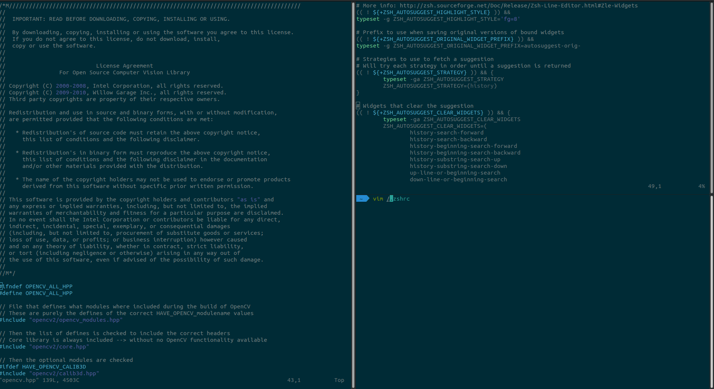

# my-zshrc
My zshrc file, which implements oh-my-zsh with agnoster theme, syntax highlighting, and autosuggestions. Be the coolest nerd around with this slick terminal layout.

## Prequisites

* [oh-my-zsh][zsh]
* [zsh-autosuggestions][suggestions]
* [zsh-syntax-highlighting][highlighting]

## Example Layout


## Tips
```{p}
right click --> preferences --> Profiles (tab) --> untick "show titlebar"
```
To also add syntax highlighting to vim:


[zsh]: https://github.com/robbyrussell/oh-my-zsh "oh-my-zsh"
[suggestions]: https://github.com/zsh-users/zsh-autosuggestions "zsh-autosuggestions"
[highlighting]: https://github.com/zsh-users/zsh-syntax-highlighting "zsh-syntax-highlighting"


